# 王占峰

任务：指导，高级项目经理


# 课程内容

每个子课程都需要提交**成果物**

网络，服务器，安全，Qt界面设计，前端，附属


# 考核

10考勤+30测验+60成果物（小组完成）


# 其他

天气影响

吃

大黑石


# 小组完成任务

每个小组  推举一名   leader   【项目经理】


# 项目

## 1	什么是项目

为了得到某种成果、产品、服务   而 付出的    临时的   一次性努力。

项目具备特性：

a	临时性： 有开始时间和明确的结束时间，项目追求结束的

b	独特性：一次性过程，可以借鉴不可以直接复制

c	渐近明细：随着时间的推移逐步细化


## 2	项目管理

原则按照流程执行     需求（明确），范围（具体），团队（组建），实施，收尾

综合利用掌握的知识，行业标准，规范，使用方法论  配合项目目标完成

通用管理规范：

P：Plan     计划，定宗旨 ，  选标准， 指导后续工作

D：Do        执行

CA：Check  Action    监督控制，  对比计划发现偏差，   修正


## 3	团队管理

P	明确角色和职责以及汇报关系，【管理沟通，技术，文档美工，情绪价值】，具体的工作   **制定人力资源计划**，可以通过OBS（组织分解结构， 层次树型结构）形式体现，  具体工作之2   **组建团队** ，采取方式     1事先分派【前期沟通有用，主动组织团队】，2招募或者谈判，3强制分派（采用随机分派原则）   ，4虚拟团队（充分利用  地理和时间不一致的资源，重点关注沟通）  ， 从0 到 1的创建团队


### 课堂实践：团队组建  

要求:    20分钟    

提交：  分组名单   ，  OBS【推荐使用processOn绘制图形】   ，  推荐Leader并且说明原因 ，  电子文档（腾讯会议聊天窗口）

吕仕通  4   ，王宇涵   1   ，宝子贺    0


D：建设团队， 从1到优的过程  ，   提升团队成员的能力（隐性知识），通常采用的方式    1 基本规则 （对事不对人）     ，  2 认可和奖励        ，   3  同地办公    。   

优秀的团队特征：有共同的目标，有行之有效的工作流程，明确自己的责任和义务，明确自己工作对他人的支持，互相学习的能力。

团队建设的周期：

​	a	形成期： 初建  ，   都有美好期望

​	b	震荡期：  开始工作  ，  形成冲突 （必然）  ，  推诿。 建议使用 RACI矩阵方式

​	c	正规期：  leader组织成员编写计划并评审确定，按计划开展，定期监控修正，组织成果

​	d	发挥期： 发挥成员的主观能动性，在规则驱使的前提下。

CA：管理团队：   解决团队成员之间的冲突。        协商     >    投票   >     强迫


# 沟通管理

PDCA：   沟通计划P， 分发信息 D ，干系人管理CA

沟通的目的： 通过合适的渠道分享信息   ，  【微信群沟通文本信息，  钉钉群分享大型文件（软件和录像），钉盘用于提交作业（https://qr.dingtalk.com/page/yunpan?route=previewDentry&spaceId=3841529409&fileId=150899768229&type=folder），课堂笔记（版本控制工具git）】

要认知到噪音对沟通的影响：积极的和消极的，   合适的噪音有助于接收者对信息的理解

沟通障碍：

1	认知障碍： 同源信息的不同理解【模板】

2	语义障碍： 多个干系人之间的理解不一致，使用标准用语。


如何高效沟通：主动沟通，及时沟通，  采取合适的沟通渠道，  采用对方能够接受的沟通风格，使用合适的沟通方式（头脑风暴  ，水平或垂直思维法）

沟通成本取决于沟通渠道数量：

计算机相关工作是高智商活动，和搬砖不同   ，   通常计算机工作的沟通成本（每沟通渠道占每人每天工作量的20%）

**课堂实践**：  有一个工作， 工作量是   4000（行代码）人天     ，   每人每天工作效率是    200 （行/天）    ，10人  ，20 人   ，   分别多久完成 （分两种情况 ——1 不考虑沟通成本，   2考虑沟通成本）

16:20  提交

建议采用决策树方式进行

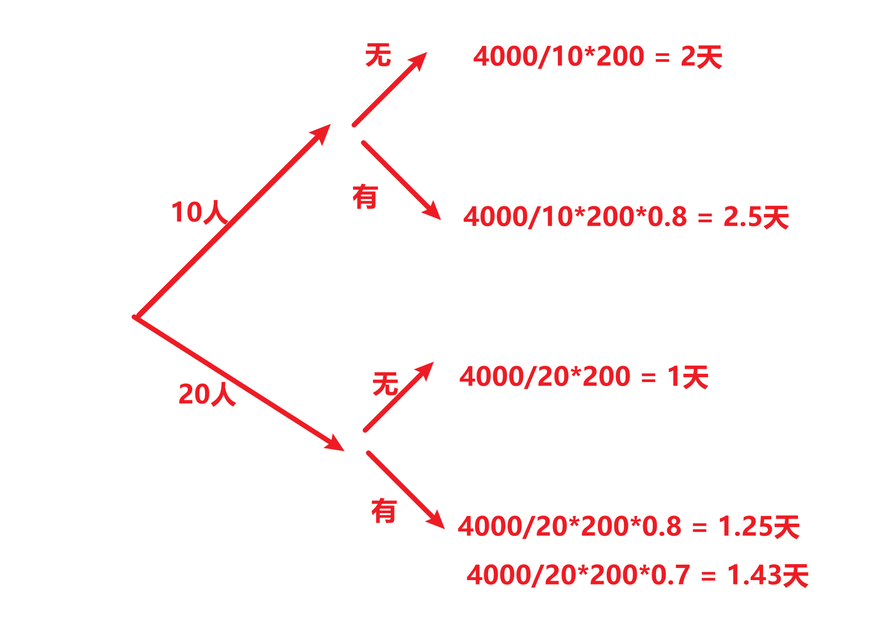

计算机多人合作过程中，  **每沟通渠道**   占  每人每天工作量的   20%-40%   

沟通渠道的计算：    N(N-1)/2   

10人的沟通渠道是      45   条   ，   每渠道 成本   200*  0.2  =  40行    ，     总沟通成本    45*40 = 1800

（4000+1800）/（10*200） =   2.9天

20人的沟通渠道是      190   条   ，   每渠道 成本   200*  0.2  =  40行    ，     总沟通成本    190*40 = 7600

（4000+7600）/（20*200） =   2.9天


工期不足：优先添加时间资源   ，次之考虑添加经验丰富的人手   （沥青潭）


# 昨日回顾

项目组织：临时性，独特性，渐近明细【波动式计划】

项目管理：PDCA   ，   需求，范围，实施，监控，收尾

人力资源管理：规划，组建，建设，管理

沟通管理：噪音，障碍（语义，认知），如何高效沟通，沟通渠道和沟通成本


作业提交存在的问题：

1	命名不规范

2	格式不统一

3	提交多次无法辨别


# 配置管理

什么是配置：系统各个组件  属性的    描述 ，  例如  手机【CPU（型号，主频，核）+内存】

配置库：多个配置项符合  某种**基线**   规划   ， 配置项的集合

常见的配置库有：

开发库：工作状态，没有权限控制

主库/动态库：review之后   ，  从开发库到动态库，权限控制【只读，变更流程更改】，阶段的产物

产品库：完整的完成产品，等待给用户安装

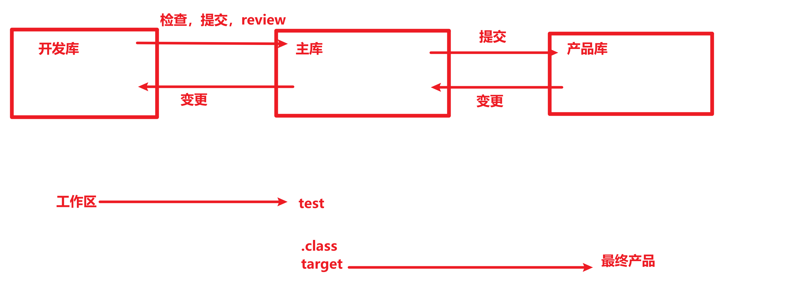

为了管理方便， 通常对不同基线做不同的版本号管理

推荐的版本号管理规则    X.Y.Z

X	代表主版本	架构的改变	C/S,B/S,分层等架构改变    X改变

Y	代表次版本	功能的改变	新增加了手机验证码		   Y改变

Z	代表修改状态  有Z代表正在修改   

草稿版    0.6  ,第一个正式版本      1.0    ，新增功能      1.1    ，正在添加功能    1.1.6   

请老师斧正  ：    xxx论文  V0.7.docx   【推荐】    xxx论文  V1.0.docx【不推荐】

版本管理的目的：确定项目成果的主要里程碑，  确保可以保留项目的所有历史文档

手工管理存在繁琐的缺陷，推荐使用版本控制工具【文档类工作内容，都可以使用该方式】	


版本工具的分类：

推荐地址：https://www.runoob.com/git/git-tutorial.html

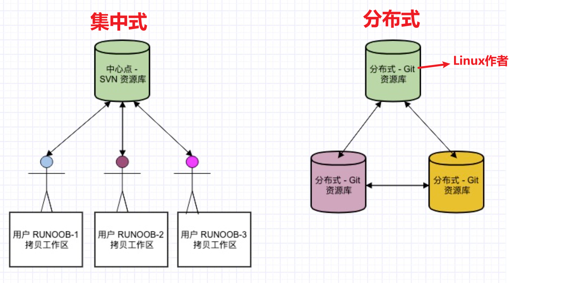

1	git的安装

一路下一步  ，确保安装成功

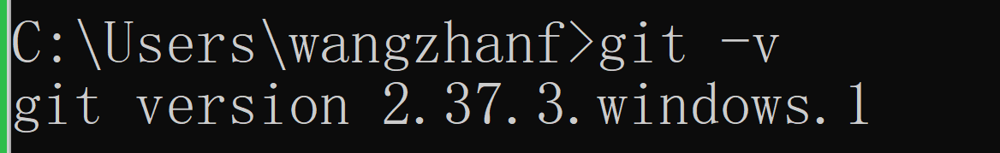

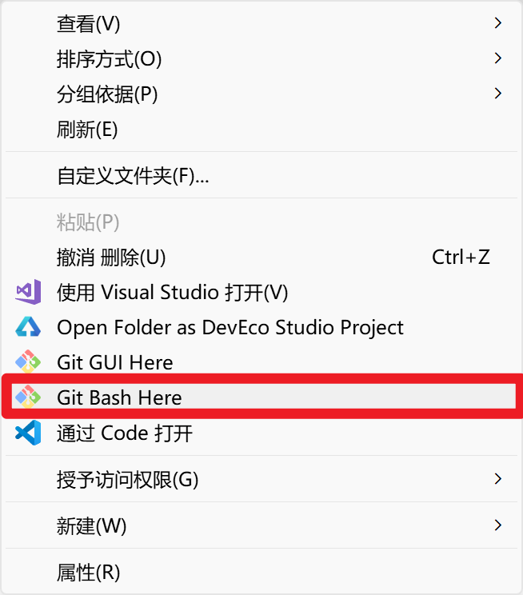

2	git配置  身份识别   ，   推荐全局配置方式，类似于linux  【命令更改配置文件】

增加：

```shell
C:\Users\wangzhanf>git config --global user.name "wangzhanf"
C:\Users\wangzhanf>git config --global user.email "wangzhanf@126.com"
```

修改：略

查询：

```shell
$ git   config   --list
$,#,c:\>     提示符    ，   代表  身份   ，   #代表  root
git		命令字    
config  参数【子命令】
--list  选项（长选项,代表整体单词）     -lia（短选项 ，代表   -l   -i    -a   缩写形式）
```

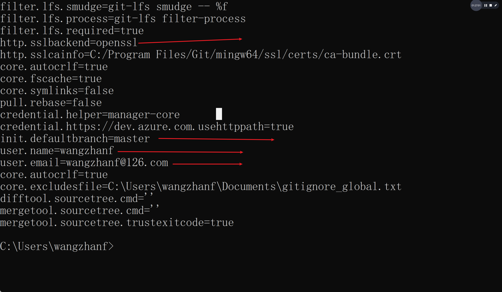

3	git的分区

## 基本概念

我们先来理解下 Git 工作区、暂存区和版本库概念：通过命令进行转移

- **工作区：**就是你在电脑里能看到的目录，当前工作的场合，拥有工作文件以及隐藏的  .git   目录。
- **暂存区：**英文叫 stage 或 index。一般存放在 **.git** 目录下的 index 文件（.git/index）中，所以我们把暂存区有时也叫作索引（index），类似于C 指针索引。
- **本地版本库：**工作区有一个隐藏目录 **.git**，这个不算工作区，而是 Git 的版本库。


4	git的基本操作

创建一个空白的工作区目录

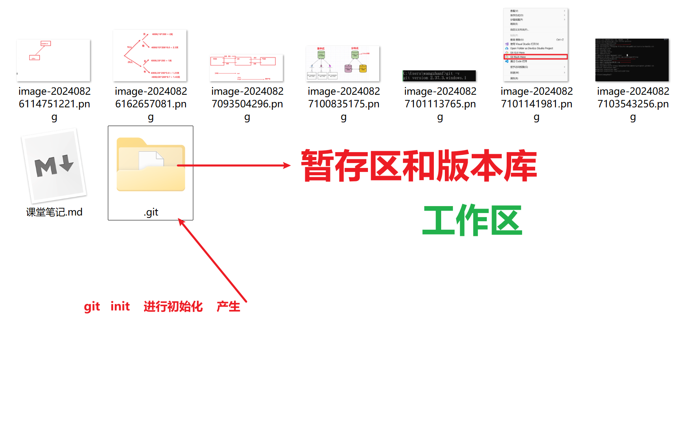

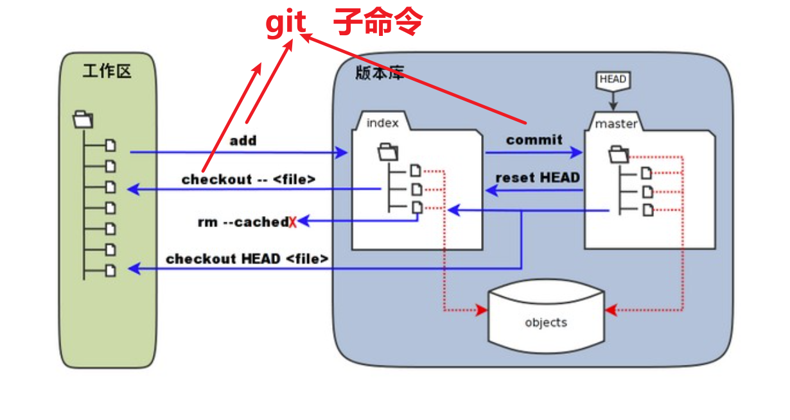

5	远程仓库的创建和关联（多人共享）

常见远程仓库 ，   gitHub       ，gitee，   gitcode  ，   gitlab（内部托管）

团队所有成员注册远程仓库的账号

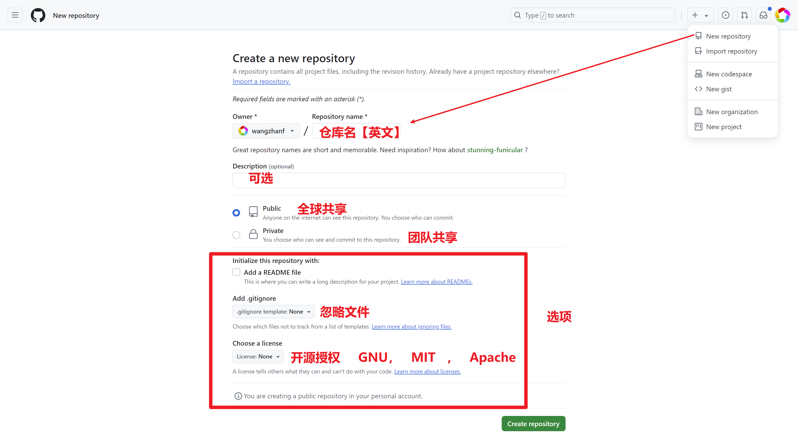

生成密钥建立安全通道

```shell
ssh-keygen -t rsa -b 4096 -C "wangzhanf@126.com"
```

配置远程仓库中的ssh密钥，   内容来源于   生成的密钥文件

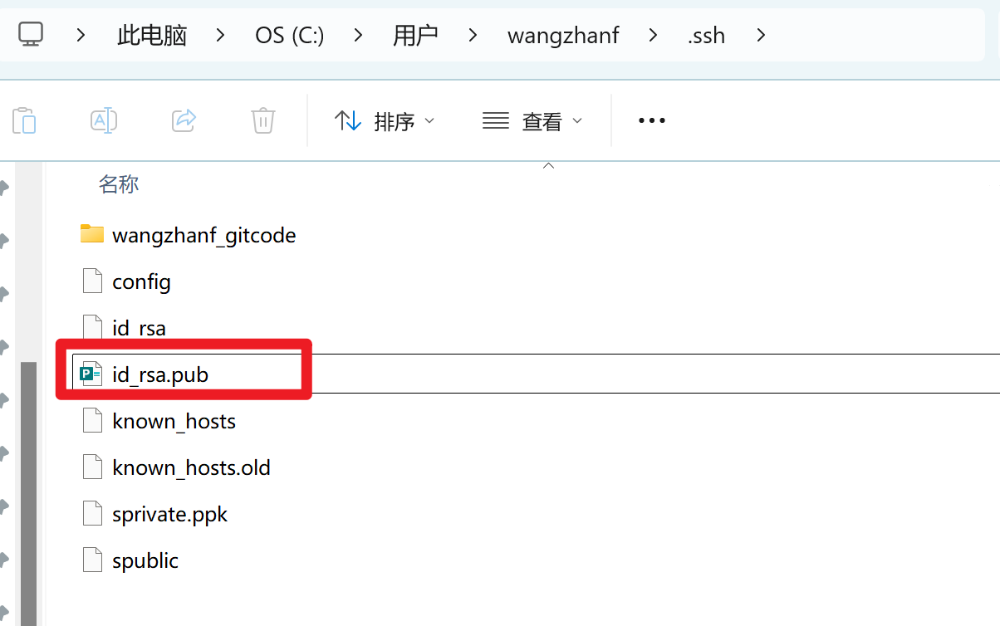

推送本地文件到远程仓库

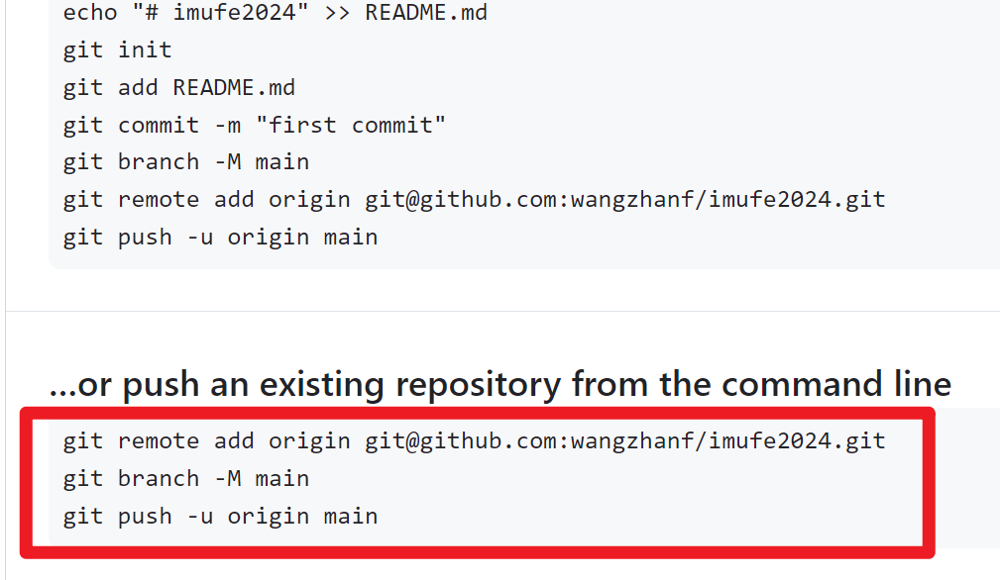

6	如何获取他人仓库，通过clone 方式获取

git@github.com:wangzhanf/imufe2024.git

```shell
git  clone   git@github.com:wangzhanf/imufe2024.git
```


