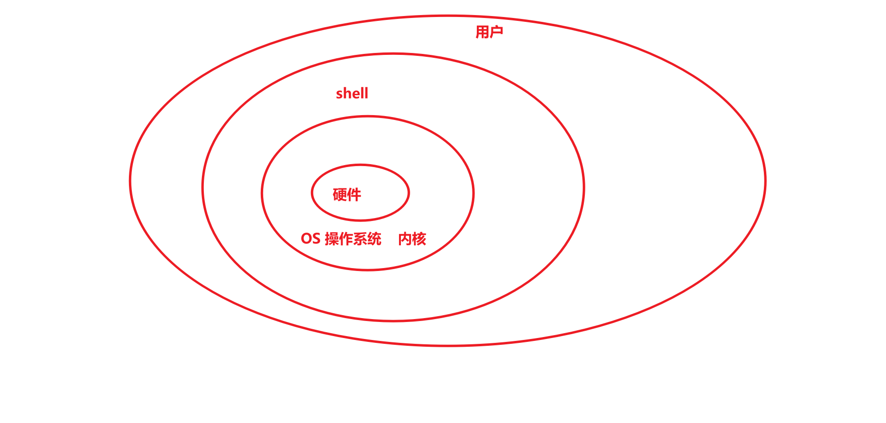
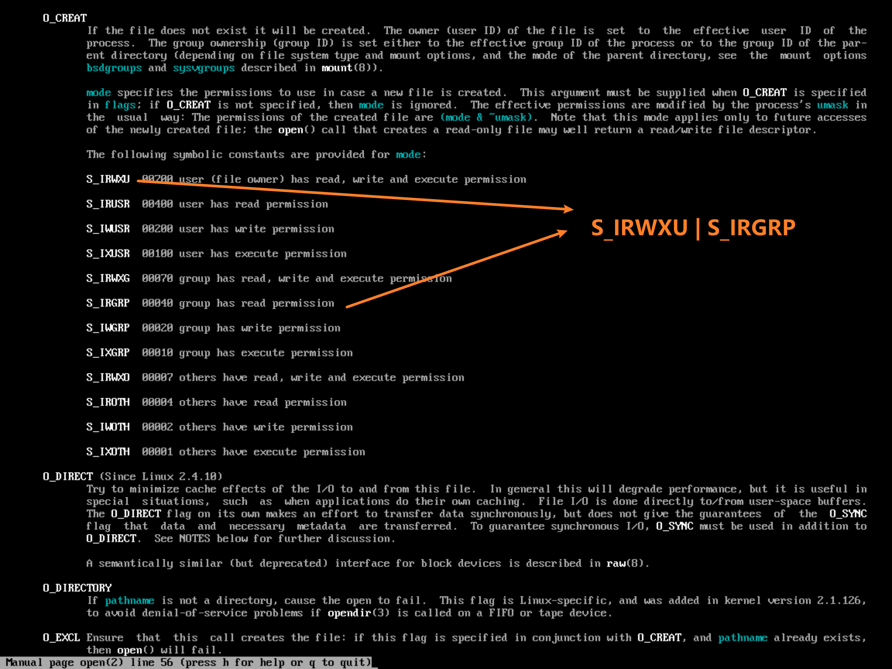

# 王占峰

任务：指导，高级项目经理


# 课程内容

每个子课程都需要提交**成果物**

网络，服务器，安全，Qt界面设计，前端，附属


# 考核

10考勤+30测验+60成果物（小组完成）


# 其他

天气影响

吃

大黑石


# 小组完成任务

每个小组  推举一名   leader   【项目经理】


# 项目

## 1	什么是项目

为了得到某种成果、产品、服务   而 付出的    临时的   一次性努力。

项目具备特性：

a	临时性： 有开始时间和明确的结束时间，项目追求结束的

b	独特性：一次性过程，可以借鉴不可以直接复制

c	渐近明细：随着时间的推移逐步细化


## 2	项目管理

原则按照流程执行     需求（明确），范围（具体），团队（组建），实施，收尾

综合利用掌握的知识，行业标准，规范，使用方法论  配合项目目标完成

通用管理规范：

P：Plan     计划，定宗旨 ，  选标准， 指导后续工作

D：Do        执行

CA：Check  Action    监督控制，  对比计划发现偏差，   修正


## 3	团队管理

P	明确角色和职责以及汇报关系，【管理沟通，技术，文档美工，情绪价值】，具体的工作   **制定人力资源计划**，可以通过OBS（组织分解结构， 层次树型结构）形式体现，  具体工作之2   **组建团队** ，采取方式     1事先分派【前期沟通有用，主动组织团队】，2招募或者谈判，3强制分派（采用随机分派原则）   ，4虚拟团队（充分利用  地理和时间不一致的资源，重点关注沟通）  ， 从0 到 1的创建团队


### 课堂实践：团队组建  

要求:    20分钟    

提交：  分组名单   ，  OBS【推荐使用processOn绘制图形】   ，  推荐Leader并且说明原因 ，  电子文档（腾讯会议聊天窗口）

吕仕通  4   ，王宇涵   1   ，宝子贺    0


D：建设团队， 从1到优的过程  ，   提升团队成员的能力（隐性知识），通常采用的方式    1 基本规则 （对事不对人）     ，  2 认可和奖励        ，   3  同地办公    。   

优秀的团队特征：有共同的目标，有行之有效的工作流程，明确自己的责任和义务，明确自己工作对他人的支持，互相学习的能力。

团队建设的周期：

​	a	形成期： 初建  ，   都有美好期望

​	b	震荡期：  开始工作  ，  形成冲突 （必然）  ，  推诿。 建议使用 RACI矩阵方式

​	c	正规期：  leader组织成员编写计划并评审确定，按计划开展，定期监控修正，组织成果

​	d	发挥期： 发挥成员的主观能动性，在规则驱使的前提下。

CA：管理团队：   解决团队成员之间的冲突。        协商     >    投票   >     强迫


# 沟通管理

PDCA：   沟通计划P， 分发信息 D ，干系人管理CA

沟通的目的： 通过合适的渠道分享信息   ，  【微信群沟通文本信息，  钉钉群分享大型文件（软件和录像），钉盘用于提交作业（https://qr.dingtalk.com/page/yunpan?route=previewDentry&spaceId=3841529409&fileId=150899768229&type=folder），课堂笔记（版本控制工具git）】

要认知到噪音对沟通的影响：积极的和消极的，   合适的噪音有助于接收者对信息的理解

沟通障碍：

1	认知障碍： 同源信息的不同理解【模板】

2	语义障碍： 多个干系人之间的理解不一致，使用标准用语。


如何高效沟通：主动沟通，及时沟通，  采取合适的沟通渠道，  采用对方能够接受的沟通风格，使用合适的沟通方式（头脑风暴  ，水平或垂直思维法）

沟通成本取决于沟通渠道数量：

计算机相关工作是高智商活动，和搬砖不同   ，   通常计算机工作的沟通成本（每沟通渠道占每人每天工作量的20%）

**课堂实践**：  有一个工作， 工作量是   4000（行代码）人天     ，   每人每天工作效率是    200 （行/天）    ，10人  ，20 人   ，   分别多久完成 （分两种情况 ——1 不考虑沟通成本，   2考虑沟通成本）

16:20  提交

建议采用决策树方式进行


计算机多人合作过程中，  **每沟通渠道**   占  每人每天工作量的   20%-40%   

沟通渠道的计算：    N(N-1)/2   

10人的沟通渠道是      45   条   ，   每渠道 成本   200*  0.2  =  40行    ，     总沟通成本    45*40 = 1800

（4000+1800）/（10*200） =   2.9天

20人的沟通渠道是      190   条   ，   每渠道 成本   200*  0.2  =  40行    ，     总沟通成本    190*40 = 7600

（4000+7600）/（20*200） =   2.9天


工期不足：优先添加时间资源   ，次之考虑添加经验丰富的人手   （沥青潭）


# 昨日回顾

项目组织：临时性，独特性，渐近明细【波动式计划】

项目管理：PDCA   ，   需求，范围，实施，监控，收尾

人力资源管理：规划，组建，建设，管理

沟通管理：噪音，障碍（语义，认知），如何高效沟通，沟通渠道和沟通成本


作业提交存在的问题：

1	命名不规范

2	格式不统一

3	提交多次无法辨别


# 配置管理

什么是配置：系统各个组件  属性的    描述 ，  例如  手机【CPU（型号，主频，核）+内存】

配置库：多个配置项符合  某种**基线**   规划   ， 配置项的集合

常见的配置库有：

开发库：工作状态，没有权限控制

主库/动态库：review之后   ，  从开发库到动态库，权限控制【只读，变更流程更改】，阶段的产物

产品库：完整的完成产品，等待给用户安装


为了管理方便， 通常对不同基线做不同的版本号管理

推荐的版本号管理规则    X.Y.Z

X	代表主版本	架构的改变	C/S,B/S,分层等架构改变    X改变

Y	代表次版本	功能的改变	新增加了手机验证码		   Y改变

Z	代表修改状态  有Z代表正在修改   

草稿版    0.6  ,第一个正式版本      1.0    ，新增功能      1.1    ，正在添加功能    1.1.6   

请老师斧正  ：    xxx论文  V0.7.docx   【推荐】    xxx论文  V1.0.docx【不推荐】

版本管理的目的：确定项目成果的主要里程碑，  确保可以保留项目的所有历史文档

手工管理存在繁琐的缺陷，推荐使用版本控制工具【文档类工作内容，都可以使用该方式】	


版本工具的分类：

推荐地址：https://www.runoob.com/git/git-tutorial.html


1	git的安装

一路下一步  ，确保安装成功


2	git配置  身份识别   ，   推荐全局配置方式，类似于linux  【命令更改配置文件】

增加：

```shell
C:\Users\wangzhanf>git config --global user.name "wangzhanf"
C:\Users\wangzhanf>git config --global user.email "wangzhanf@126.com"
```

修改：略

查询：

```shell
$ git   config   --list
$,#,c:\>     提示符    ，   代表  身份   ，   #代表  root
git		命令字    
config  参数【子命令】
--list  选项（长选项,代表整体单词）     -lia（短选项 ，代表   -l   -i    -a   缩写形式）
```


3	git的分区

## 基本概念

我们先来理解下 Git 工作区、暂存区和版本库概念：通过命令进行转移

- **工作区：**就是你在电脑里能看到的目录，当前工作的场合，拥有工作文件以及隐藏的  .git   目录。
- **暂存区：**英文叫 stage 或 index。一般存放在 **.git** 目录下的 index 文件（.git/index）中，所以我们把暂存区有时也叫作索引（index），类似于C 指针索引。
- **本地版本库：**工作区有一个隐藏目录 **.git**，这个不算工作区，而是 Git 的版本库。


4	git的基本操作

创建一个空白的工作区目录


5	远程仓库的创建和关联（多人共享）

常见远程仓库 ，   gitHub       ，gitee，   gitcode  ，   gitlab（内部托管）

团队所有成员注册远程仓库的账号


生成密钥建立安全通道

```shell
ssh-keygen -t rsa -b 4096 -C "wangzhanf@126.com"
```

配置远程仓库中的ssh密钥，   内容来源于   生成的密钥文件


推送本地文件到远程仓库


6	如何获取他人仓库，通过clone 方式获取【第一次】

git@github.com:wangzhanf/imufe2024.git

```shell
git  clone   git@github.com:wangzhanf/imufe2024.git
```

远程文件更新后， 获取最新【每一次】

```shell
git  pull
```


推荐的工作流程

1	每天开始时      git   pull    拉取最新

2	修改自己负责的文件  并且    add   commit    push


课堂实践：

每个小组创建自己的远程仓库【gitee，gitcode】，  给自己的小组取名   ，   小组所有成员可以维护仓库内容，  将完整过程写成一个**简易教程**（推荐使用  Typora编写） ，   每个组提供  仓库地址    即可。   截止时间  ：   17：00  


# 昨日回顾

组件的属性进行规范，  配置管理

配置:属性描述

配置库：多个配置项达到了某个    基线   ，    【开发库，主库，产品】

版本管理模式：    X.Y.Z                ，     0.6  草稿版 


版本控制工具   Git  分布式   


Typora编写教程：   全员学习  软件的使用，

Git： 所有成员注册账号    ，   远程仓库建立和配置

编写自己负责的部分： 远程， 组员本地  ，   


目前的状态   ：    打哪指哪      【不推荐】   应该是    指哪打哪


# 时间/进度/周期管理

确保在deadline之前完成任务

时间管理的主要流程：

P：

​	活动定义：识别完成项目所需要的工作/活动  【反复的过程】

​	活动排序：确定活动之间的依赖关系，逻辑依赖关系，常见存在 4种依赖关系【**FS**，SF（升级项目，更新类），SS，FF】，通常使用     单代号网络图PDM【工作使用节点表示，箭头表示FS关系】，或者箭线图ADM【节点表示关键点标识，线标识逻辑关系以及工期，使用虚活动--虚线  表示依赖关系，不消耗任何资源】表示 常见的   FS关系

​	活动资源估算： 识别有效可用资源  ，  通常资源来自于   资源日历   

​	活动历时估算： 估算任务的 近似时间     ，     方法：   

​				最直接的   ：     工作量/有效资源数            4000行代码/10人*200行   =   2 天历时

​				科学的方式：推荐使用   PERT技术  ，  三点估算技术，    考虑     最好，最差，通用   三种情况，分别采样   ，常见公式    (最好+最差+4通用)/  6   =   期望值  ；   结合标准差和正态分布  进行概率计算。  标准差 = （最差 - 最好）/6  


​	制定进度计划：通过调配资源，缩短关键路径活动历时，压缩工期 ，   为了便于汇报  ，   使用      甘特图   进行描述。  甘特图使用日历日表示， 使用计划和实现对比方式监控项目

D：

CA：对比甘特图发现偏差，分析原因，原因可消除采取纠偏 （赶工  ，     提高工作效率   ，    适当并行）  ，  原因不可消除变更计划


甘特图表示


假定一个活动  ， 最好情况  11天完成   ，     最差情况   21天完成，    依据以前经验通常在  16天完成   ，     最接近的期望值为？      （11+21+16*4）=   16   天    ，标准差   =  （21 - 11） /6  = 1.67


# 成本管理

过程   ：P  成本计划  成本估算   ，成本预算  D    CA  成本控制

成本计划：    识别项目的各项活动

成本估算：  识别成本项并求得近似成本   。

成本预算：   将成本分配到各项活动中，  建立成本基线


CA成本控制：

结合 挣值管理技术     EVT技术  ，  监测项目的进展和预测未来

三个基础值

PV：计划值        ，    PV：60

AC：实际成本     ，   AC： 70

EV：挣值 ， 当前工作的价值    ，  EV：   40

两个状态  指标   

CV：成本偏差   ，    CV =  EV - AC    ，    小于0  超支，    等于0   符合   ，   大于0   节约。

SV：进度偏差   ，    SV =  EV  -   PV   ，   小于0  滞后，    等于0   符合   ，   大于0   提前。

问题：    一个项目   AC   小于    PV   是否代表节约？   否定   ， 不存在数学关系  

​                A、B两个项目   ，  A项目  CV = -1万      ，  B项目      CV = 10万   ，   无法判断管理 程度。   


两个绩效   指标   

CPI：成本绩效指数   ，    CPI =  EV / AC    ，    小于1  超支，    等于1   符合   ，   大于1   节约。    例如     SPI  0.6  相当于花了1元创造了  0.6的价值

SPI：进度绩效指数  ，    SPI=  EV  /   PV   ，   小于1  滞后，    等于1   符合   ，   大于1   提前。


预测未来：

BAC  总的计划值：总PV    

ETC    完工尚需成本：    

​			典型偏差（偏差继续）：       ETC =    (BAC -  EV)  /  CPI    

​            非典型偏差（偏差修正）：   ETC   =   BAC   -   EV


EAC     完工总成本    ：    EAC   =    ETC     +    AC


课堂案例：

已知某信息工程由A、B、C、D、E、F、G、H八个活动构成，项目的活动历时，活动所需人数、费用及活动逻辑关系如下表所示

| 活动 | 历时（单位：天） | 所需人数 | 费用（单位：元/人天） | 紧前活动 |
| ---- | ---------------- | -------- | --------------------- | -------- |
| A    | 3                | 3        | 100                   | -        |
| B    | 2                | 1        | 200                   | A        |
| C    | 8                | 4        | 400                   | A        |
| D    | 4                | 3        | 100                   | B        |
| E    | 10               | 2        | 200                   | C        |
| F    | 7                | 1        | 200                   | C        |
| G    | 8                | 3        | 300                   | D        |
| H    | 5                | 4        | 200                   | E、F、G  |

【问题1】（4分）

请给出该项目的关键路径和工期

【问题2】（12分）

第14天晚的监控数据显示活动E、G均完成一半，F尚未开始，项目实际成本支出为12000元。

（1）请计算此时项目的计划值（PV）和挣值（EV）

（2）请判断次时项目的成本偏差（CV）和进度偏差（SV），以及成本和进度执行情况

【问题3】（3分）

若后续不作调整，项目工期是否有影响？为什么？

【问题4】（6分）

（1）请给出总预算（BAC）、完工尚需估算（ETC）和完工估算（EAC）的值。

（2）请预测是否会超出总预算(BAC)？完工偏差（VAC）是多少？


## **课堂实践：**

下图给出了一个信息系统项目的进度网络图

 

下表给出了该项目各项作业正常工作与赶工工作的时间和费用

| 活动 | 正常工作 |         | 赶工工作 |         |
| ---- | -------- | ------- | -------- | ------- |
|      | 时间/天  | 费用/元 | 时间/天  | 费用/元 |
| A    | 2        | 1200    | 1        | 1500    |
| B    | 4        | 2500    | 3        | 2700    |
| C    | 10       | 5500    | 7        | 6400    |
| D    | 4        | 3400    | 2        | 4100    |
| E    | 7        | 1400    | 5        | 1600    |
| F    | 6        | 1900    | 4        | 2200    |
| G    | 5        | 1100    | 3        | 1400    |
| H    | 6        | 9300    | 4        | 9900    |
| I    | 7        | 1300    | 5        | 1700    |
| J    | 8        | 4600    | 6        | 4800    |
| K    | 2        | 300     | 1        | 400     |
| L    | 4        | 900     | 3        | 1000    |
| M    | 5        | 1800    | 3        | 2100    |
| N    | 6        | 2600    | 3        | 2960    |

【问题1】（3分）

请给出项目关键路径

【问题2】（3分）

请计算项目总工期

【问题3】（19分）

（1）请计算关键路径上各活动的可缩短时间，每缩短一天增加的费用和增加的总费用。将关键路径上各活动的名称以及对应的计算结果填入答题纸相对应的表格中

（2）如果项目工期要求缩短到38天，请给出具体的工期压缩方案并计算需要增加的最少费用。


# 昨日回顾

进度管理   ：

三点估算PERT，正态分布，PDM前导图--单代号，ADM箭线图--双代号，时标网络图，甘特图

成本管理   ：

成本基线，应急储备，管理储备，PV，AC，EV，CV，CPI，SV，SPI，ETC


# 质量，风险 ，需求，范围


# 服务器安全

常见的架构    C/S   或者   B/S   架构，     不限于操作系统   ，   DMZ安全的一部分

DNS，EMAIL，DHCP，WWW


使用通用操作系统实现

## 操作系统

管理，分配，协调   硬件资源    

常见的操作系统管理：     进程管理    ， 存储管理，文件管理，作业管理


如何实现操作系统：

主机系统  ，   wsl 【安装】   ，  虚拟机   【vmware  ，    virtual box  ，   **hyper-v**】


### Hyper-V的使用


 在bios中开启       Intel-VTX/Intel-VTD开启(Enable)即可 

执行批处理脚本     xxx.bat

 启用或关闭Windows功能 ，所有Hyper-V相关项

使用Hyper-V管理器


### 安装操作系统

一路下一步

centos推荐使用自动化分区


## shell

shell的作用：操作OS的接口  



常见的shell：

cmd,powershell   ,  bash   ,csh  ,ksh       ,      linux下使用何种默认shell在   /etc/passwd   中   ，      使用   /bin/bash   ，  如果   使用  /sbin/nologin     代表该用户不可以使用终端登录   。   


shell的基本使用：

1	使用上下方向键翻阅历史记录   

2	使用history可以查看历史记录列表   ，      ！编号     重复执行 ，    例如     ！110

3	可以使用  /？   /help   查看帮助    ，    linux中  可以通过    “ man    章节号    关键字   ”   查阅      ，例如     printf  


4	可以使用tab  键    补齐   目录  以及   命令      【当唯一时】


bash的基本格式：


shell命令：


windows下可以将    执行程序的目录   添加到系统环境变量     path   中      

linux下   同样    ，   Linux对环境变量的操作   ，    set展示所有   环境变量 ，     $环境变量名                展示变量值   ,设置环境变量        export    

```shell
set		查看
echo	查看
export	设置
例如将   /home/zs添加到path环境变量
export PATH=$PATH:/home/zs


```


### shell特殊操作

1	多个命令可以使用  ;   分隔，   一次执行多个命令   

2	标准设备 ，  /dev/stdin   0     默认是键盘   【/】 ，  ,      /dev/stdout  1 默认是显示器 ,  /dev/stderr    2     默认是显示器 

3	重定向       >   覆盖输出重定向，    >>     追加输出重定向          等同于     1>>     ，     2>>   标准错误重定向     ，   &>>   将标准输出1和标准错误2   全部重定向

4	重定向       <   输入重定向      ，    例如      wc -l    <   /etc/passwd

5	中断处理快捷方式  ，     Ctrl+C      ，   Ctrl+Z      ，      ctrl+D    

6	|   管道 ，   命令1    |   命令2   |  命令3    ，    将前一个命令的输出结果作为下一个命令的输入


grep   检索，    cat   连接文件查看   ，     wc    统计    


课堂实践：

创建自己的脚本    /my/sysinfo      ,    可以在任意位置  执行该脚本    ，    该脚本的作用是    查询  系统  中的  外置输入设备数量（/dev/input ）并显示到屏幕上【拒绝使用vi编辑器】


类似于       工业母机    ，   meta   元编程


```shell
1	创建 创建脚本  的  脚本，这样就可以重复在各个机器上使用了
$cd ~
$echo "#script start" >> ps.bat
$mkdir /my
$echo "echo 'ls -l /dev/input | grep cr | wc -l' >> /my/sysinfo " >> ps.bat
$echo "chmod u+x /my/sysinfo" >> ps.bat
$echo "export PATH=$PATH:/my" >> ps.bat
$chmod u+x ps.bat

2	拷贝ps.bat  到每个主机执行      即可

$./ps.bat
```


# 用户和组管理

都是基于   DAC   访问控制 ，（安全级别较高的场合   MAC，RBAC） ，   自主访问控制   。  由超级用户给系统用户分配权限


通过组  集中赋权，  组   是  用户的集合   ，   一个用户可以属于多个组  ，  用户会继承组的权限


用户和组   的  配置文件          /etc/passwd     /etc/shadow    /etc/group     

基本操作命令       groupadd     ,   groupmod    ,      groupdel     

​                              useradd       ,    usermod       ,   userdel   ,  passwd    

模拟  取经四人组    


使用useradd创建用户时  ，    默认会创建同名组      ，    通常建议   先创建组    ，然后创建    用户   

useradd   常见选项   -g指定默认组    ，   -G指定所属组   -s   指定shell

linux系统默认提供  了    7个终端（ctrl+alt+F1~F7）   ，     虚拟终端 tty

创建用户的时候， 会拷贝   用户模板文件   到     /home    创建用户宿主目录    【用户漫游】


课堂实践【无需提交】：小组为单位，   规划    一个   小型企业（市场部，研发部，后勤部）  ，   员工    A,B,C,D

E,F,G       ,    AB属于市场部， CD属于研发部，EF属于后勤部  ，   G是老板，【隐含   root用户和root组】


# 文件

文件的权限

文件的权限和用户相关


基本的文件操作：

mkdir       创建目录    ，   -p   可以创建多级目录

ls        列出目录列表        ，   -l   列表（一行一个文件）   ，   -a全部（包括   .  开头的隐藏文件）   ，  -R   递归 

创建文件       ：     touch   ，   vi      ,     >      >>        

查看文件信息：     file   文件名    


1	修改文件的属主和数组

chown   用户名      文件名

chgrp     组名           文件名


简化为 ：    chown     用户名:组名      文件名     ，    如果下级所有目录都递归修改  ，   -R   


2	修改权限


课堂实践作业：文件的权限管理

将主要过程和命令     ，验证过程 【闭环】   ，    需要两类系统实现【linux   ，     windows系统实现】


文件的权限， 依靠   用户和组     id识别   （linux   uid   ，    windows     sid），


多用户登录    ：

1	exit  退出当前用户，   登录新用户

2	ctrl+alt+F1到F7   多终端登录

3	通过su   switch   user   切换用户     ，   

4	通过  sudo  临时使用超管账号执行   ，       super do   ，      修改     /etc/sudoers    允许切换

5	使用远程终端方式    ，    mstsc   或者     xshell     


在linux系统中，   系统开启时会自动执行的脚本文件 ，    /etc/profile 【系统级】      ，   ~/.bashrc   【用户级】


演练：   可以通过物理机    远程连接    虚拟机    


使用     程序    控制文件

C    C++     编译性的静态语言    ，   需要   编译器     gcc     


# 前置条件

1	配置网络	，   安驱动，配IP（ip addr   ），启动网卡  (ifup    eth0   )，  测试（ping   www.baidu.com  ）

2	修改源   

# 安装软件

linux系统安装软件的方式

1	二进制压缩包       tar.gz       ,     编译安装

2	本地文件安装        rpm       ，    使用rpm  工具

3	应用市场                yum，apt    ，必须联网    


注意：

1	备份       /etc/yum.repos.d   目录    ，  启用  网卡     ifup    eth0

2	使用        curl下载

```shell
curl -o  CentOS-Base.repo http://mirrors.aliyun.com/repo/Centos-7.repo
curl -o epel.repo http://mirrors.aliyun.com/repo/epel-7.repo
```

3	yum clean all   ;   yum   makecache     

4	安装软件       yum  install     软件名   ,  例如安装c编译环境    gcc       yum install gcc    ，  安装    vim   ,


# vi编辑器

典型的    字符界面   编辑器     

常见模式：     编辑模式， 普通模式   ，    末行模式       

编辑模式：    文档内容的修改

普通模式：     查看和通过命令   编辑文档

末行模式：     文件操作     


周末思考：   使用vi+gcc+c   编写一个   拷贝文件的  程序   ，   fopen    ,fread   ,   fwrite


# 上课回顾

权限管理：id    有关    ，      属主、属组、其他     ，     助记符   ugoa  +-=    rwx    ,  八进制

软件的安装 ：   rpm    ，   tar.gz      ,     应用市场（yum   ，    apt  ）

vi的基本使用：   三种模式    ，  一般模式，编辑模式，末行模式   

gcc + vi  ， 实现系统级程序    ，   iostream    重载     >>    <<     ,    std::cin  抽取输入流

​        std::cout        插入输出流     ,      FILE    指针


## 文件操作

基于  linux系统调用实现

一切皆文件 

如何通过系统调用（system call）操作文件  


常见文件的系统调用    

open    ，     read    ，   write   

open打开文件形成文件操作的句柄【文件描述符    file   description   】

通过   man   获取帮助    

如果没有man手册

```shell
# yum install    man-pages

# yum   install  sl   //  一个小火车的字符画
```


查看man手册





open函数解释：

```tex
int open(1,2,3)
返回值是文件描述符，用于其他系统调用
1参是字符串， 用于描述打开文件的名称
2参是flag，用于设置打开文件的选型，如创建文件或者截断操作
3参是mode，用于设置文件的权限
```


### 创建第一个系统调用程序

1	编写源代码 openDemo.c

```c
#include <sys/types.h>
#include <sys/stat.h>
#include <fcntl.h>

int main(int argc,char** argv)
{
        int fd = 99999;
        fd = open("aa.txt",O_WRONLY | O_CREAT,S_IRWXU | S_IRGRP);
        if(fd < 0)
                return 126;
        else
                return 0;
}
```

2	编译执行

```shell
# gcc -o openDemo openDemo.c

# ./openDemo

#  echo $?   
```


### 对文件进行读写

系统调用  write   ，  

1	编写程序源代码


```c
#include <sys/types.h>
#include <sys/stat.h>
#include <fcntl.h>
#include <unistd.h>

int main(int argc,char** argv)
{
        int fd = 99999;
        fd = open("bb.txt",O_WRONLY ,S_IRWXU | S_IRGRP);
        if(fd < 0){
                ssize_t wc = write(1,"no open\n",8);
                return 126;
        }
        else{
                if(write(fd,"hello c",7)!=7){
                        close(fd);
                }
                close(fd);
                return 0;
        }
}
```


系统调用  read


课堂实践：   实现自己的  cp  程序  ，       两个版本，    版本1 使用 单字符作为缓冲区   ，   版本2使用   数组作为缓冲区，   对比两个程序     计算运行时间    （使用time   ）  ，验证缓冲区大于8192时的变化  。  提交详细的实现和验证过程  以及  结论    ，    附属   小组组内评分   ，提交到    github仓库

| 成员姓名 | 具体工作           | 评分 |
| -------- | ------------------ | ---- |
| 张三     | 查找资料，编辑文档 | 8    |
| 李四     | 编写第一个版本     | 6    |
| 王五     | 编写第二个版本     | 3    |


整组成果物得分    80分  ，张三     80+  2.3    ，  王五    80  -   2.6

组内评分为   0   ，   则整个成果物分  为    0；


附：linux创建大文件的方法

```shell
# dd if=/dev/zero of=big_file bs=1M count=1024
# fallocate -l 1G big_file
```


参考答案

```c
#include <sys/types.h>
#include <sys/stat.h>
#include <fcntl.h>
#include <stdio.h>
#include <unistd.h>

int main(int argc,char* argv[])
{
        char buff;//小勺     一个字符的缓冲区
        int inFile,outFile;
        inFile = open("source.txt",O_RDONLY);
        outFile = open("dest.txt",O_WRONLY|O_CREAT,S_IRUSR|S_IWUSR);
        if ((inFile == -1) || (outFile == -1)){
                write(1,"file not open!\n",15);//1代表   标准输出     stdout   1
                return 126;
        }
        while(read(inFile,&buff,1) == 1)   //   read(int fd, void* bu, size_t count)
                write(outFile,&buff,1);
        close(inFile);
        close(outFile);
        return 0;

}
```


```c
#include <sys/types.h>
#include <sys/stat.h>
#include <fcntl.h>
#include <stdio.h>
#include <unistd.h>

int main(int argc,char* argv[])
{
        char buff[8192*2];
        int inFile,outFile;
        ssize_t nread;
        umask(0002);//修改掩码，   默认创建的文件     0775
        inFile = open("source.txt",O_RDONLY);
        outFile = open("dest.txt",O_WRONLY|O_CREAT,S_IRUSR|S_IWUSR|S_IRGRP|S_IWGRP);
        if ((inFile == -1) || (outFile == -1)){
                write(1,"file not open!\n",15);
                return 126;
        }
        while((nread = read(inFile,buff,sizeof(buff))) > 0)  //8192*2  ， 0 ，  -1  ，  888
                write(outFile,buff,nread);
        close(inFile);
        close(outFile);
        return 0;

}
```


C和C++中 ，    数组的名称   就是    数组 的地址  （指针）   ，也就是数组  第  1个元素   [0] 的地址

​						 函数的名称就是函数的地址（指针）


程序的简单  运行机制

1	键入命令   mycp2    ，首先查找系统内存【类似ls】，   找不到则按照    path   环境变量配置的路径找   

2	因为键入命令的时候  是在     shell【bash】下     ，  则会由   bash   派生一个子进程 【默认就打开了   0，1，2   fd    ，   可以接受  bash传递过来的数据，     填充到     argc    argv[]】   ， 


```c
#include <sys/types.h>
#include <sys/stat.h>
#include <fcntl.h>
#include <stdio.h>
#include <unistd.h>

int main(int argc,char* argv[])
{
        char buff[8192*2];
        int inFile,outFile;
        ssize_t nread;
        umask(0002);
        if(argc < 3){
                printf("%s,%s,%s\n",argv[0],argv[1],argv[2]);
                write(1,"usage error\n",12);
                return 888;
        }
        inFile = open(argv[1],O_RDONLY);
        outFile = open(argv[2],O_WRONLY|O_CREAT,S_IRUSR|S_IWUSR|S_IRGRP|S_IWGRP);
        if ((inFile == -1) || (outFile == -1)){
                write(1,"file not open!\n",15);
                return 126;
        }
        while((nread = read(inFile,buff,sizeof(buff))) > 0)
                write(outFile,buff,nread);
        close(inFile);
        close(outFile);
        return 0;

}
```


一切皆文件   ，      类unix系统    存在   /proc   文件系统   ，     系统运行信息映射到    /proc   【从不备份】


## 文件的其他操作

lseek	文件读写指针移位  【偏移】

chown/chgrp     改变属主和属组

umask	改变掩码

chmod	改变权限

link，unlink，symlink       链接

linux系统有两种链接

​	1	硬链接：  文件的一个映射，inode编号相同，索引次数+1，当索引为1时再删除则从硬盘清空，ln 源文件  硬链接文件   ，   不能跨硬盘  【每个硬盘的node编号都是从   0  开始的】

​	2	符号链接：     **独立**的文件，inode编号不同，指向其他文件的快捷方式  ， 文件类型为  l   ，   ln   -s    源文件    软链接文件   ， 删除源文件   软链接失效，  跨硬盘     


课堂练习：     创建软链接和硬链接，   查看不同，思考应用场合


判定文件是否改变等状态时   ，    使用  **命令**     stat      判断


需要 通过     stat，fstat，lstat   **系统调用**判断文件的状态，并采取错误


实现自己的  mystat.c

```c
#include <sys/types.h>
#include <sys/stat.h>
#include <fcntl.h>
#include <stdio.h>
#include <unistd.h>

int main(int argc,char* argv[])
{
        int inFile;
        umask(0002);
        if(argc < 2){
                printf("%s,%s,%s\n",argv[0],argv[1],argv[2]);
                write(1,"usage error\n",12);
                return 888;
        }
        inFile = open(argv[1],O_RDONLY);
        if ((inFile == -1 )){
                write(1,"file not open!\n",15);
                return 126;
        }
        struct stat pool;
        stat(argv[1],&pool);
        //fstat(inFile,&pool);
        printf("uid:%d\n",pool.st_uid);
        printf("gid:%d\n",pool.st_gid);
        printf("mode:%d\n",pool.st_mode);
        if(S_ISREG(pool.st_mode))
                printf("this is is regular file.\n");

        if((pool.st_mode & 0170000) == 0040000)
                printf("this file is directory\n");
        //close(inFile);
        return 0;
}
```


111

100

100


# 涉及到的位运算：

按位进行运算

常见运算       &      |       ^       >>      <<

13              9        

13&9 = 9                          13|9=13                     13^9=4

1101								 1101								1101                       1101

1001&							  1001   | 						  1001   ^                  0100  ^

-----------------------------------------------------------------------------------

1001=9                             1101=13                          0100=4                 1001=9


# 目录操作

目录也是一个普通文件，目录记录了所关联 的文件的   node信息  

具体目录使用的系统调用  

mkdir  创建目录，   chdir     改变目录（cd  ）   


```c
#include <sys/types.h>
#include <sys/stat.h>
#include <fcntl.h>
#include <unistd.h>
#include <stdio.h>
#include <stdlib.h>
#include <dirent.h>

int main(int argc, char* argv[])
{
        DIR *dir_ptr;
        struct dirent *direntp;
        if(argc < 2){
                write(1,"usage error\n",12);
        }

        struct stat pool;

        if ((dir_ptr = opendir(argv[1])) == NULL)
                perror("can not open folder");
        else{
                while ((direntp = readdir(dir_ptr))!= NULL){
                        printf("%11.2ld\t\t",direntp->d_ino);
                        stat(direntp->d_name,&pool);
                        if(S_ISREG(pool.st_mode))
                                printf("-\t\t");
                        if((pool.st_mode & 0170000) == 0040000)
                                printf("d\t\t");
                        else
                                printf("o\t\t");
                        printf("%s\n",direntp->d_name);
                }
                closedir(dir_ptr);
        }
        return 0;
}
```


mycp    ,  mystat      ,   myls     


# 进程管理

什么是进程：程序的执行过程  

进程 是  管理资源的基本单位    


进程管理：   每个进程都认为自己  独占   系统  资源  【虚拟内存】 。


## 通过命令如何管理进程

1	创建进程    ：     执行一个程序   ，通常在  shell下执行       例如      echo 123      运行后自动结束退出 ,    cat   持续运行      ，   ping    某个ip    &    后台运行   。

2	关闭进程：     ctrl+C    停止当前  前台进程     ，   kill    -9   pid      给进程发信号【信号从  1-31 】

3	查看进程：    ps  -aux       ，      top       ，     pstree  查看进程树


## 通过系统调用管理进程

fork（）创建子进程   ，   从当前进程派生一个子进程   ，   派生出来的子进程复制  父进程     虚拟内存  【除了  PCB  中的  pid  ，ppid   ，    父进程打开的fd，代码   子进程都拥有】

fork()    返回   

getpid（），返回当前进程的pid，   getppid()  ， 返回父进程的pid


```c

int main()
{
    int a = 111;
    printf(a);
    fork();
    printf(++a);
    return 0;
}


```


结合前驱图 分析    


课堂实践：   

编写一个程序，   运行时    派生一个子进程    执行拷贝文件操作  ，    再派生一个子进程 进行   查看文件状态。 

```c
#include <unistd.h>
#include <stdio.h>
#include <sys/types.h>
#include <sys/stat.h>
#include <fcntl.h>
#include <stdlib.h>

int main()
{
        pid_t pid,spid;
        pid = fork();//返回2个值  ，    0 代表子  ，  >0代表父
        if(pid == 0){
                printf("this is child process,copy file \n");
                printf("current process pid:%d,parent pid:%d\n",getpid(),getppid());
                //copy file
                int inFd,outFd;
                inFd = open("aa.txt",O_RDONLY);
                outFd = open("bb.txt",O_WRONLY|O_CREAT,S_IRUSR|S_IWUSR);
                char buff;
                if(inFd == -1 || outFd == -1){
                        write(1,"file not open\n",15);
                        return 126;
                }
                while(read(inFd,&buff,1) == 1){
                        write(outFd,&buff,1);
                }
                close(inFd);
                close(outFd); 
                printf("cp child process end\n");
        }else if(pid > 0){
                printf("this is parent process, do nothing \n");
                printf("current process pid:%d,parent pid:%d\n",getpid(),getppid());
                spid = fork();
                if(spid == 0){
                        printf("this is child process,get file stat \n");
                        printf("current process pid:%d,parent pid:%d\n",getpid(),getppid());
                        //get file stat
                        struct stat pool;
                        stat("aa.txt",&pool);
                        printf("uid: %d\n",pool.st_uid);
                        if((pool.st_mode & 0170000) == 0100000){
                                printf("this is file is regular\n");
                        }
                        printf("stat child process end\n");
                }                
        }else{
                perror("fork error");
        }
        return 0;
}
```


# 上课回顾

文件的其他操作：  基本上每个命令大多都有对应的系统调用     chmod，umask，chgrp

硬链接和符号链接：  link， symlink    ，       ln    命令  

main函数是程序的入口  ，argc   ，   argv      ，   $?

进程命令：    ps -aux   ,   top   ,   [/proc/cpuinfo]  ,     kill   -9      pid    ,  运行命令

进程编程：    fork()  ，父进程和各个子进程的运行关系都是平等的（运行顺序不可控）


## wait()系统调用


需要使用 传出整型参数作为   记录子进程退出的    记录  ，     信号退出，状态值  为   信号值   。 其他退出可以使用系统提供的宏解析。


## exec系统调用

在程序中调用其他独立进程

由   exec家族实现的


exec产生的系统调用会  挖空   虚拟内存空间，    由被调用程序   替代  。


# linux系统基础 综合作业

要求创建自己的工具箱mytools【使用方便 ,  】，  通过工具箱快速调用自己创建的工具，如  查看文件状态的  mystat(仿stat)   ，   查看目录列表的  myls （仿ls -lia）  ，    复制文件的mycp（仿cp能拷贝文件即可），  查看当前系统内存信息   mymi（读取 /proc/meminfo），   使用方式要求为如下形式   。


 ```shell
# mytools myls /etc
# mytools mystat /etc/passwd
# mytools mycp /etc/passwd  ./passwd.bak
# mytools mymi


演化版
#mytools  
#<mytools> myls /etc
#<mytools> mystat /etc/passwd
#<mytools> mycp /etc/passwd  ./passwd.bak
#<mytools> mymi
 ```

 提交详细**理论依据**说明，规划进程前驱图，详细的实现和验证过程  以及  结论总结    ，    附属   小组组内评分   ，提交到    github仓库  ，    截止    9月5日    晚    23：59 

| 成员姓名 | 具体工作           | 评分 |
| -------- | ------------------ | ---- |
| 张三     | 查找资料，编辑文档 | 8    |
| 李四     | 编写第一个版本     | 6    |
| 王五     | 编写第二个版本     | 3    |


总结：

为了工具使用方便：  应该将工具箱和工具都添加到   环境变量    

​									  每个工具都可以通过多种方式被调用   

项目的构建方式：

​								结构化程序的设计和实现方式


# 毕设课题：

综合大学服务器系统部署  【不推荐】

​      必须形成   理论  ，   实践   ， 验证   ，优化     ，再验证       闭环

基于容错技术的   综合大学服务器系统部署


```c++
class myTools{
    static string getIp()
        {
            //
            return ip;

        }
};

main()
{
    myTools *mt = new MyTools;
    string revIp = mt->getIP();
    
    string revIp = myTools::getIP();
}

```


# 结构化程序设计

自上而下分解过程

程序的各个部分拆解为多个阶段  依次进行   

也称之为    瀑布    模型   

测试   不等同于      调试   【测试是根据需求       有计划的    使用   最少的用例   发现   尽可能   多的   缺陷】


通常使用结构化设计常用工具

1	数据流DFD   ：  数据如何加工处理的

使用工具   探测   局域网  所有   成活的节点   

确定接口         ————》     批量扫描（例外）       --------》   形成  记录


判断是否是同一个局域网  ，    判定    网络ID是否相同

IP =   网络ID  +   主机ID

获得网络ID的方法   ：    IP   &    子网掩码   


参考：   IPO图     【input---》   process  -- 》   output】


为了避免重复造轮子   ，   可以考虑使用  胶水语言【脚本语言】   调用已有的工具库即可

shell脚本【命令集合，   类似于    windows 下     bat  】


 linux下shell编程：

参考： [Linux Shell 编程基础详解——吐血整理，墙裂推荐！ - 尘世风 - 博客园 (cnblogs.com)](https://www.cnblogs.com/feng0815/p/14290418.html) 


1	结构 

```shell
#!/bin/bash


exit
```

2	运行

```shell
chmod u+x ipscan.sh
./ipscan.sh
```

3	特性

c使用函数调用返回值判断执行逻辑

合理使用       >     1>      2>      &>      

4	通配符的使用


5	环境变量和参数的使用

$数字      形参                  


普通变量       变量名=值      赋值，      调用     $变量名

环境变量        export   


6	判断条件

使用助记符进行判断         a   gt    b       ，    a       eq    b    


7	程序控制

if   [ name eq "zhangsan"]     

then

else

fi

支持所有的程序结构  ：   分支，  循环，跳转【exit】

shell编程提供了语法糖：     if   [ -d    /home ]   


8	读取用户输入

read    


9	封装复用的代码

函数封装

使用function关键字定义

function fcname(){    $1就是形参1      }

调用     fcname   实参1  实参2


应用场合：    

​		服务器批量部署

​		防火墙配置


课堂实践：  以组为形式实现一个扫描指定网段存活主机的脚本。

要求提供至少2层的数据流图， 脚本实现过程并且通过注释解释脚本功能。拓展实施【提供一个GUI界面】

提交到github


