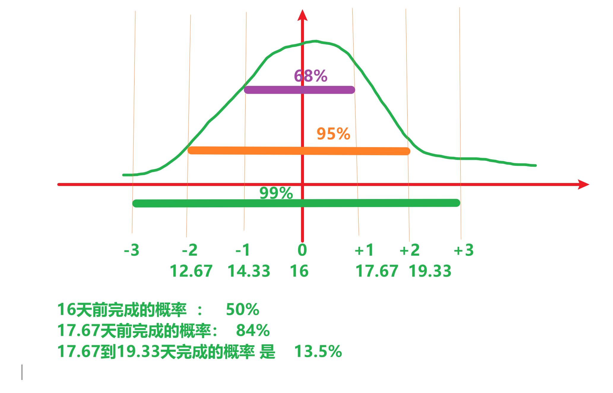
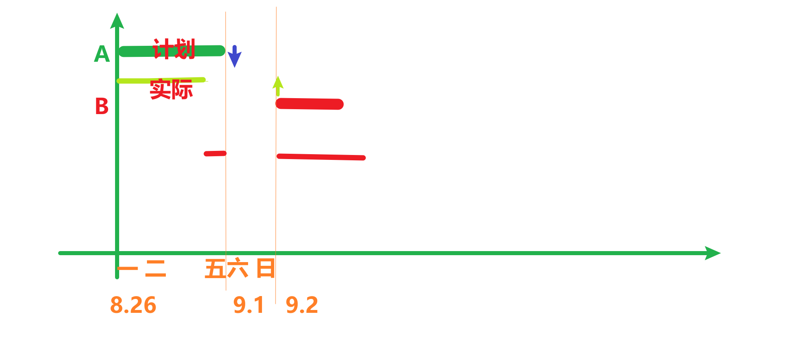
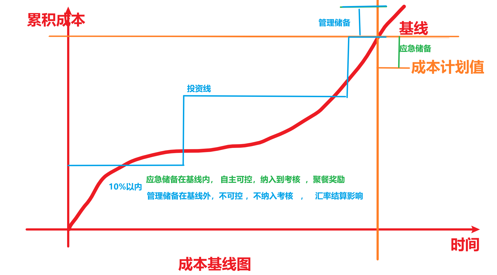

# 王占峰

任务：指导，高级项目经理


# 课程内容

每个子课程都需要提交**成果物**

网络，服务器，安全，Qt界面设计，前端，附属


# 考核

10考勤+30测验+60成果物（小组完成）


# 其他

天气影响

吃

大黑石


# 小组完成任务

每个小组  推举一名   leader   【项目经理】


# 项目

## 1	什么是项目

为了得到某种成果、产品、服务   而 付出的    临时的   一次性努力。

项目具备特性：

a	临时性： 有开始时间和明确的结束时间，项目追求结束的

b	独特性：一次性过程，可以借鉴不可以直接复制

c	渐近明细：随着时间的推移逐步细化


## 2	项目管理

原则按照流程执行     需求（明确），范围（具体），团队（组建），实施，收尾

综合利用掌握的知识，行业标准，规范，使用方法论  配合项目目标完成

通用管理规范：

P：Plan     计划，定宗旨 ，  选标准， 指导后续工作

D：Do        执行

CA：Check  Action    监督控制，  对比计划发现偏差，   修正


## 3	团队管理

P	明确角色和职责以及汇报关系，【管理沟通，技术，文档美工，情绪价值】，具体的工作   **制定人力资源计划**，可以通过OBS（组织分解结构， 层次树型结构）形式体现，  具体工作之2   **组建团队** ，采取方式     1事先分派【前期沟通有用，主动组织团队】，2招募或者谈判，3强制分派（采用随机分派原则）   ，4虚拟团队（充分利用  地理和时间不一致的资源，重点关注沟通）  ， 从0 到 1的创建团队


### 课堂实践：团队组建  

要求:    20分钟    

提交：  分组名单   ，  OBS【推荐使用processOn绘制图形】   ，  推荐Leader并且说明原因 ，  电子文档（腾讯会议聊天窗口）

吕仕通  4   ，王宇涵   1   ，宝子贺    0


D：建设团队， 从1到优的过程  ，   提升团队成员的能力（隐性知识），通常采用的方式    1 基本规则 （对事不对人）     ，  2 认可和奖励        ，   3  同地办公    。   

优秀的团队特征：有共同的目标，有行之有效的工作流程，明确自己的责任和义务，明确自己工作对他人的支持，互相学习的能力。

团队建设的周期：

​	a	形成期： 初建  ，   都有美好期望

​	b	震荡期：  开始工作  ，  形成冲突 （必然）  ，  推诿。 建议使用 RACI矩阵方式

​	c	正规期：  leader组织成员编写计划并评审确定，按计划开展，定期监控修正，组织成果

​	d	发挥期： 发挥成员的主观能动性，在规则驱使的前提下。

CA：管理团队：   解决团队成员之间的冲突。        协商     >    投票   >     强迫


# 沟通管理

PDCA：   沟通计划P， 分发信息 D ，干系人管理CA

沟通的目的： 通过合适的渠道分享信息   ，  【微信群沟通文本信息，  钉钉群分享大型文件（软件和录像），钉盘用于提交作业（https://qr.dingtalk.com/page/yunpan?route=previewDentry&spaceId=3841529409&fileId=150899768229&type=folder），课堂笔记（版本控制工具git）】

要认知到噪音对沟通的影响：积极的和消极的，   合适的噪音有助于接收者对信息的理解

沟通障碍：

1	认知障碍： 同源信息的不同理解【模板】

2	语义障碍： 多个干系人之间的理解不一致，使用标准用语。


如何高效沟通：主动沟通，及时沟通，  采取合适的沟通渠道，  采用对方能够接受的沟通风格，使用合适的沟通方式（头脑风暴  ，水平或垂直思维法）

沟通成本取决于沟通渠道数量：

计算机相关工作是高智商活动，和搬砖不同   ，   通常计算机工作的沟通成本（每沟通渠道占每人每天工作量的20%）

**课堂实践**：  有一个工作， 工作量是   4000（行代码）人天     ，   每人每天工作效率是    200 （行/天）    ，10人  ，20 人   ，   分别多久完成 （分两种情况 ——1 不考虑沟通成本，   2考虑沟通成本）

16:20  提交

建议采用决策树方式进行


计算机多人合作过程中，  **每沟通渠道**   占  每人每天工作量的   20%-40%   

沟通渠道的计算：    N(N-1)/2   

10人的沟通渠道是      45   条   ，   每渠道 成本   200*  0.2  =  40行    ，     总沟通成本    45*40 = 1800

（4000+1800）/（10*200） =   2.9天

20人的沟通渠道是      190   条   ，   每渠道 成本   200*  0.2  =  40行    ，     总沟通成本    190*40 = 7600

（4000+7600）/（20*200） =   2.9天


工期不足：优先添加时间资源   ，次之考虑添加经验丰富的人手   （沥青潭）


# 昨日回顾

项目组织：临时性，独特性，渐近明细【波动式计划】

项目管理：PDCA   ，   需求，范围，实施，监控，收尾

人力资源管理：规划，组建，建设，管理

沟通管理：噪音，障碍（语义，认知），如何高效沟通，沟通渠道和沟通成本


作业提交存在的问题：

1	命名不规范

2	格式不统一

3	提交多次无法辨别


# 配置管理

什么是配置：系统各个组件  属性的    描述 ，  例如  手机【CPU（型号，主频，核）+内存】

配置库：多个配置项符合  某种**基线**   规划   ， 配置项的集合

常见的配置库有：

开发库：工作状态，没有权限控制

主库/动态库：review之后   ，  从开发库到动态库，权限控制【只读，变更流程更改】，阶段的产物

产品库：完整的完成产品，等待给用户安装


为了管理方便， 通常对不同基线做不同的版本号管理

推荐的版本号管理规则    X.Y.Z

X	代表主版本	架构的改变	C/S,B/S,分层等架构改变    X改变

Y	代表次版本	功能的改变	新增加了手机验证码		   Y改变

Z	代表修改状态  有Z代表正在修改   

草稿版    0.6  ,第一个正式版本      1.0    ，新增功能      1.1    ，正在添加功能    1.1.6   

请老师斧正  ：    xxx论文  V0.7.docx   【推荐】    xxx论文  V1.0.docx【不推荐】

版本管理的目的：确定项目成果的主要里程碑，  确保可以保留项目的所有历史文档

手工管理存在繁琐的缺陷，推荐使用版本控制工具【文档类工作内容，都可以使用该方式】	


版本工具的分类：

推荐地址：https://www.runoob.com/git/git-tutorial.html


1	git的安装

一路下一步  ，确保安装成功


2	git配置  身份识别   ，   推荐全局配置方式，类似于linux  【命令更改配置文件】

增加：

```shell
C:\Users\wangzhanf>git config --global user.name "wangzhanf"
C:\Users\wangzhanf>git config --global user.email "wangzhanf@126.com"
```

修改：略

查询：

```shell
$ git   config   --list
$,#,c:\>     提示符    ，   代表  身份   ，   #代表  root
git		命令字    
config  参数【子命令】
--list  选项（长选项,代表整体单词）     -lia（短选项 ，代表   -l   -i    -a   缩写形式）
```


3	git的分区

## 基本概念

我们先来理解下 Git 工作区、暂存区和版本库概念：通过命令进行转移

- **工作区：**就是你在电脑里能看到的目录，当前工作的场合，拥有工作文件以及隐藏的  .git   目录。
- **暂存区：**英文叫 stage 或 index。一般存放在 **.git** 目录下的 index 文件（.git/index）中，所以我们把暂存区有时也叫作索引（index），类似于C 指针索引。
- **本地版本库：**工作区有一个隐藏目录 **.git**，这个不算工作区，而是 Git 的版本库。


4	git的基本操作

创建一个空白的工作区目录


5	远程仓库的创建和关联（多人共享）

常见远程仓库 ，   gitHub       ，gitee，   gitcode  ，   gitlab（内部托管）

团队所有成员注册远程仓库的账号


生成密钥建立安全通道

```shell
ssh-keygen -t rsa -b 4096 -C "wangzhanf@126.com"
```

配置远程仓库中的ssh密钥，   内容来源于   生成的密钥文件


推送本地文件到远程仓库


6	如何获取他人仓库，通过clone 方式获取【第一次】

git@github.com:wangzhanf/imufe2024.git

```shell
git  clone   git@github.com:wangzhanf/imufe2024.git
```

远程文件更新后， 获取最新【每一次】

```shell
git  pull
```


推荐的工作流程

1	每天开始时      git   pull    拉取最新

2	修改自己负责的文件  并且    add   commit    push


课堂实践：

每个小组创建自己的远程仓库【gitee，gitcode】，  给自己的小组取名   ，   小组所有成员可以维护仓库内容，  将完整过程写成一个**简易教程**（推荐使用  Typora编写） ，   每个组提供  仓库地址    即可。   截止时间  ：   17：00  


# 昨日回顾

组件的属性进行规范，  配置管理

配置:属性描述

配置库：多个配置项达到了某个    基线   ，    【开发库，主库，产品】

版本管理模式：    X.Y.Z                ，     0.6  草稿版 


版本控制工具   Git  分布式   


Typora编写教程：   全员学习  软件的使用，

Git： 所有成员注册账号    ，   远程仓库建立和配置

编写自己负责的部分： 远程， 组员本地  ，   


目前的状态   ：    打哪指哪      【不推荐】   应该是    指哪打哪


# 时间/进度/周期管理

确保在deadline之前完成任务

时间管理的主要流程：

P：

​	活动定义：识别完成项目所需要的工作/活动  【反复的过程】

​	活动排序：确定活动之间的依赖关系，逻辑依赖关系，常见存在 4种依赖关系【**FS**，SF（升级项目，更新类），SS，FF】，通常使用     单代号网络图PDM【工作使用节点表示，箭头表示FS关系】，或者箭线图ADM【节点表示关键点标识，线标识逻辑关系以及工期，使用虚活动--虚线  表示依赖关系，不消耗任何资源】表示 常见的   FS关系

​	活动资源估算： 识别有效可用资源  ，  通常资源来自于   资源日历   

​	活动历时估算： 估算任务的 近似时间     ，     方法：   

​				最直接的   ：     工作量/有效资源数            4000行代码/10人*200行   =   2 天历时

​				科学的方式：推荐使用   PERT技术  ，  三点估算技术，    考虑     最好，最差，通用   三种情况，分别采样   ，常见公式    (最好+最差+4通用)/  6   =   期望值  ；   结合标准差和正态分布  进行概率计算。  标准差 = （最差 - 最好）/6  



​	制定进度计划：通过调配资源，缩短关键路径活动历时，压缩工期 ，   为了便于汇报  ，   使用      甘特图   进行描述。  甘特图使用日历日表示， 使用计划和实现对比方式监控项目

D：

CA：对比甘特图发现偏差，分析原因，原因可消除采取纠偏 （赶工  ，     提高工作效率   ，    适当并行）  ，  原因不可消除变更计划


甘特图表示




假定一个活动  ， 最好情况  11天完成   ，     最差情况   21天完成，    依据以前经验通常在  16天完成   ，     最接近的期望值为？      （11+21+16*4）=   16   天    ，标准差   =  （21 - 11） /6  = 1.67


# 成本管理

过程   ：P  成本计划  成本估算   ，成本预算  D    CA  成本控制

成本计划：    识别项目的各项活动

成本估算：  识别成本项并求得近似成本   。

成本预算：   将成本分配到各项活动中，  建立成本基线




CA成本控制：

结合 挣值管理技术     EVT技术  ，  监测项目的进展和预测未来

三个基础值

PV：计划值        ，    PV：60

AC：实际成本     ，   AC： 70

EV：挣值 ， 当前工作的价值    ，  EV：   40

两个状态  指标   

CV：成本偏差   ，    CV =  EV - AC    ，    小于0  超支，    等于0   符合   ，   大于0   节约。

SV：进度偏差   ，    SV =  EV  -   PV   ，   小于0  滞后，    等于0   符合   ，   大于0   提前。

问题：    一个项目   AC   小于    PV   是否代表节约？   否定   ， 不存在数学关系  

​                A、B两个项目   ，  A项目  CV = -1万      ，  B项目      CV = 10万   ，   无法判断管理 程度。   


两个绩效   指标   

CPI：成本绩效指数   ，    CPI =  EV / AC    ，    小于1  超支，    等于1   符合   ，   大于1   节约。    例如     SPI  0.6  相当于花了1元创造了  0.6的价值

SPI：进度绩效指数  ，    SPI=  EV  /   PV   ，   小于1  滞后，    等于1   符合   ，   大于1   提前。


预测未来：

BAC  总的计划值：总PV    

ETC    完工尚需成本：    

​			典型偏差（偏差继续）：       ETC =    (BAC -  EV)  /  CPI    

​            非典型偏差（偏差修正）：   ETC   =   BAC   -   EV


EAC     完工总成本    ：    EAC   =    ETC     +    AC


课堂案例：

已知某信息工程由A、B、C、D、E、F、G、H八个活动构成，项目的活动历时，活动所需人数、费用及活动逻辑关系如下表所示

| 活动 | 历时（单位：天） | 所需人数 | 费用（单位：元/人天） | 紧前活动 |
| ---- | ---------------- | -------- | --------------------- | -------- |
| A    | 3                | 3        | 100                   | -        |
| B    | 2                | 1        | 200                   | A        |
| C    | 8                | 4        | 400                   | A        |
| D    | 4                | 3        | 100                   | B        |
| E    | 10               | 2        | 200                   | C        |
| F    | 7                | 1        | 200                   | C        |
| G    | 8                | 3        | 300                   | D        |
| H    | 5                | 4        | 200                   | E、F、G  |

【问题1】（4分）

请给出该项目的关键路径和工期

【问题2】（12分）

第14天晚的监控数据显示活动E、G均完成一半，F尚未开始，项目实际成本支出为12000元。

（1）请计算此时项目的计划值（PV）和挣值（EV）

（2）请判断次时项目的成本偏差（CV）和进度偏差（SV），以及成本和进度执行情况

【问题3】（3分）

若后续不作调整，项目工期是否有影响？为什么？

【问题4】（6分）

（1）请给出总预算（BAC）、完工尚需估算（ETC）和完工估算（EAC）的值。

（2）请预测是否会超出总预算(BAC)？完工偏差（VAC）是多少？


## **课堂实践：**

下图给出了一个信息系统项目的进度网络图

 

下表给出了该项目各项作业正常工作与赶工工作的时间和费用

| 活动 | 正常工作 |         | 赶工工作 |         |
| ---- | -------- | ------- | -------- | ------- |
|      | 时间/天  | 费用/元 | 时间/天  | 费用/元 |
| A    | 2        | 1200    | 1        | 1500    |
| B    | 4        | 2500    | 3        | 2700    |
| C    | 10       | 5500    | 7        | 6400    |
| D    | 4        | 3400    | 2        | 4100    |
| E    | 7        | 1400    | 5        | 1600    |
| F    | 6        | 1900    | 4        | 2200    |
| G    | 5        | 1100    | 3        | 1400    |
| H    | 6        | 9300    | 4        | 9900    |
| I    | 7        | 1300    | 5        | 1700    |
| J    | 8        | 4600    | 6        | 4800    |
| K    | 2        | 300     | 1        | 400     |
| L    | 4        | 900     | 3        | 1000    |
| M    | 5        | 1800    | 3        | 2100    |
| N    | 6        | 2600    | 3        | 2960    |

【问题1】（3分）

请给出项目关键路径

【问题2】（3分）

请计算项目总工期

【问题3】（19分）

（1）请计算关键路径上各活动的可缩短时间，每缩短一天增加的费用和增加的总费用。将关键路径上各活动的名称以及对应的计算结果填入答题纸相对应的表格中

（2）如果项目工期要求缩短到38天，请给出具体的工期压缩方案并计算需要增加的最少费用。


